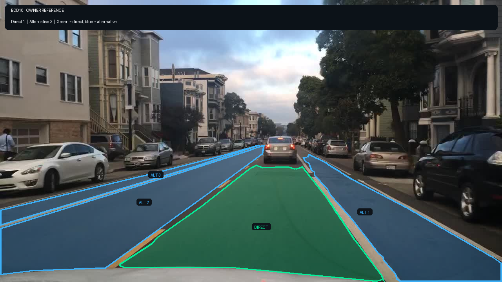
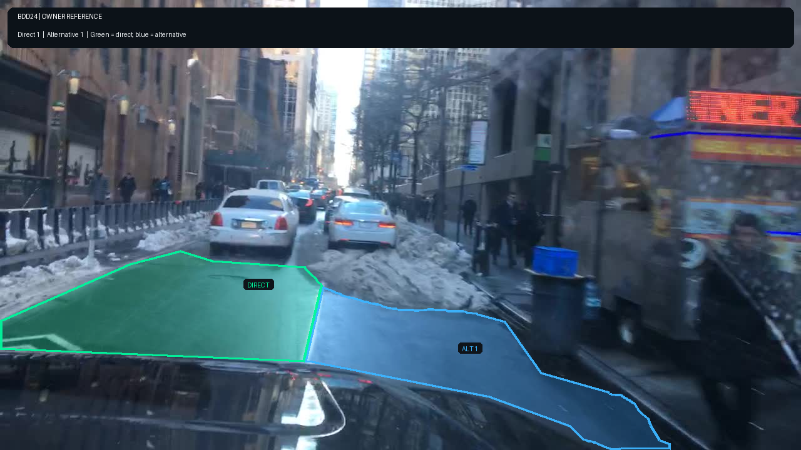
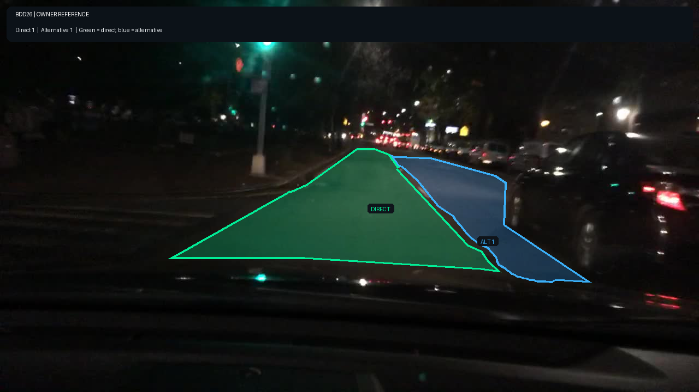

# Annotation guideline — Ego-centric drivable area trên BDD100K

**Version:** v3

## 1. Objective + scope

Tạo polygon vùng mặt đường đang khả dụng phục vụ mô hình phân đoạn/topology nhìn từ xe ego. Label phần mặt đường dành
cho xe cơ giới khi nó thuộc corridor ego đang đi hoặc là lane/nhánh ego có thể đi vào hợp lệ. Không label vỉa hè,
curb, dải phân cách, đảo giao thông, grass/dirt verge, ray tàu, vùng sau barrier/guardrail, lề khẩn cấp, curbside
parking strip, opposing lane không được phép đi vào, footprint nhìn thấy của xe/người/vật cản, vùng hoàn toàn khuất
và nắp capo xe ego.

## 2. Annotation unit

- Task ảnh tĩnh; dùng **Shape → Polygon**, không dùng Track.
- Một annotation là một polygon `drivable_area` cho một vùng liên thông, nhìn thấy và không bị chiếm dụng, có cùng
  `area_type`.
- Tách polygon khi `area_type` đổi, hoặc khi vùng bị ngăn bởi curb, median, barrier, grass, xe/người/vật cản hay
  khoảng ngoài khung. Nhiều polygon tách bởi vật cản có thể cùng `area_type`.
- Xe/người/vật cản tạm thời không làm phần mặt đường còn nhìn thấy đổi `area_type`, nhưng footprint nhìn thấy của
  chúng phải bị loại khỏi polygon; đi biên quanh vật cản hoặc tách thành các polygon không chồng lấn.
- Lane marking, crosswalk, mũi tên, manhole và patch asphalt nằm trên mặt đường được giữ trong polygon.
- **Kiểm tra đủ vùng trước export:** đếm các polygon sau khi vẽ và rà lại từng vùng mặt đường liên thông còn thấy được.
  Tách vùng khi `area_type` đổi hoặc vật cản/khoảng ngoài khung làm ngắt vùng; không gộp mọi asphalt thành một
  polygon direct. Với BDD10, target gold đã freeze là 4 polygon (1 direct + 3 alternative), không phải một polygon.

## 3. Geometry rule

1. Đặt điểm tại mọi chỗ biên đổi hướng; không dùng rectangle/polyline.
2. Biên gần bám mép tiếp xúc giữa mặt đường và curb/sidewalk/grass/barrier. Khi vạch edge line tách shoulder ngoài
   scope, dừng polygon ở mép ngoài của vạch và giữ bản thân vạch trong polygon.
3. Cạnh dưới kết thúc ở mép trên nắp capo/dashboard.
   Không kéo polygon xuống phần nắp capo dù phần này phủ kín chiều ngang ảnh.
4. Cạnh xa kết thúc tại nơi còn bằng chứng. Không nối polygon xuyên qua footprint của xe/người/vật cản; đi biên
   quanh phần nhìn thấy hoặc tách polygon nếu công cụ không biểu diễn được lỗ.
5. Direct và alternative kề nhau dùng chung ranh giới ở giữa lane marking; không để khe hoặc overlap quá 2 px.
6. Tolerance: biên rõ tiền cảnh ≤5 px; biên xa/mờ/mưa/tuyết/đêm ≤10 px. Nếu không thể chốt chắc, vẽ best-effort và
   đặt `needs_review=true`.

## 4. Taxonomy

| Label / attribute | Ý nghĩa | Giá trị |
|---|---|---|
| `drivable_area` | Vùng mặt đường dành cho xe cơ giới theo scope | polygon |
| `area_type` | Quan hệ với ego/right-of-way | `direct`, `alternative` |
| `needs_review` | Bằng chứng không đủ chắc hoặc guideline chưa cover | `false`, `true` |

`undefined` và `__undefined__` là trạng thái chưa gán, **không phải kết quả hợp lệ**.

### Phân biệt `area_type`

- `direct`: vùng chứa điểm chiếu của xe ego ở cạnh dưới ảnh và corridor ego đang đi/có quyền ưu tiên để tiếp tục.
- `alternative`: lane liền kề hoặc nhánh nối mà ego có thể đi vào bằng lane change, turn, exit hoặc merge hợp lệ
  nhưng hiện không cùng trạng thái ưu tiên.
- Opposing lane/carriageway mà ego không được phép đi vào không phải alternative và không label.
- Shoulder, bike lane, curbside parking strip và vùng chỉ dành cho dừng khẩn cấp không phải alternative.

## 5. Inclusion / exclusion

**Bắt buộc label:**

- corridor asphalt/concrete chứa ego → `direct`;
- lane liền kề có thể đi vào hợp lệ → `alternative`;
- phần junction/crosswalk thuộc corridor ưu tiên của ego → `direct`;
- side street, turn pocket, ramp hoặc driveway công cộng có thể đi vào hợp lệ → `alternative`.

**IGNORE, không vẽ polygon:**

- sidewalk, curb, median, traffic island, painted gore có đường bao liên tục;
- grass, soil, snowbank và puddle nằm ngoài mép đường;
  Không mở rộng vùng drivable vào snowbank chỉ vì curb bị tuyết che; `needs_review` không thay đổi inclusion/exclusion.
- shoulder ngoài edge line liên tục, parking strip, bike lane;
- vùng sau guardrail/barrier và opposing carriageway tách vật lý;
- bãi đỗ/driveway tư nhân không đủ bằng chứng kết nối;
- reflection, shadow hoặc khoảng tối không chứng minh được là mặt đường.
- footprint nhìn thấy của xe, người và vật cản; không tô mặt đường giả định nằm bên dưới.

## 6. Visibility / occlusion

- **Che một phần:** giữ `area_type` cho các phần mặt đường còn nhìn thấy, nhưng loại footprint vật cản; đi biên quanh
  vật cản hoặc tách polygon vì CVAT polygon không biểu diễn lỗ.
- **Cắt mép ảnh:** polygon kết thúc đúng trên mép ảnh.
- **Nhỏ/xa:** label khi còn xác định được kết nối và `area_type`; không đoán vùng chỉ vài pixel.
- **Mưa, loá, phản chiếu, bóng tối, tuyết:** kết hợp curb, edge line, xe, barrier và continuity. Nếu lựa chọn class
  hoặc biên có thể thay đổi đáng kể diện tích, đặt `needs_review=true`.
- **Đêm / vùng tối:** độ tối tự nó không chứng minh có mặt đường. Kết thúc polygon tại ranh roadway cuối cùng còn
  bằng chứng quan sát được; không kéo đến horizon, tán cây, mép ảnh hoặc qua xe đỗ. Nếu ranh chưa chắc, đánh dấu
  `needs_review=true` nhưng vẫn chỉ vẽ phần có bằng chứng.
- **Occlusion lớn:** không kéo polygon qua tòa nhà, barrier hoặc vùng hoàn toàn khuất.

## 7. Ambiguity / escalation

1. **LABEL:** class và biên đủ bằng chứng → vẽ polygon, chọn `area_type`, giữ `needs_review=false`.
2. **UNKNOWN cục bộ:** vẫn chọn `area_type` hợp lý nhất; nếu sai số biên chỉ nhỏ hơn tolerance mở rộng thì không cần
   review, nếu lớn hơn thì đặt `needs_review=true`.
3. **ESCALATE:** direct/alternative còn tranh chấp, hoặc biên không chắc có thể làm thay đổi >10% vùng gần xe → chọn
   best-effort `area_type` và đặt `needs_review=true`.
4. **Ảnh rất khó:** nếu vẫn tìm được vùng có bằng chứng, vẽ các polygon best-effort và đặt `needs_review=true` cho
   mọi polygon chịu ảnh hưởng. Nếu hoàn toàn không có bằng chứng cho một vùng, IGNORE thay vì tạo polygon giả.
5. **IGNORE:** vùng ngoài scope → không vẽ; không dùng review để hợp thức hóa sidewalk, shoulder hay snowbank.

Trước khi export, mọi polygon phải có `area_type=direct|alternative`; không được còn `undefined` hoặc
`__undefined__`.

## 8. Temporal rule

Không áp dụng — task ảnh tĩnh. Mỗi ảnh độc lập.

## 9. Examples

| sample_id | Thấy gì | Expected output | Rule áp dụng |
|---|---|---|---|
| BDD01 | Highway ban ngày, lane hiện tại và lane liền kề rõ | Các polygon `drivable_area`: lane ego có `area_type=direct`; lane có thể chuyển vào có `area_type=alternative`; không label vùng ngoài barrier/grass | §3–§5 |
| BDD02 | City intersection có crosswalk và đường giao cắt | Crosswalk/corridor ưu tiên của ego là direct; nhánh có thể đi vào là alternative; sidewalk/traffic island bị loại | §3, §4, §5 |
| BDD16 | Nhánh tách/nhập dưới cầu và painted gore | Corridor ego là direct; nhánh hợp lệ là alternative; painted gore không label | §4, §5 |
| BDD23 | Đường tuyết, xe đỗ che curb | Vẽ best-effort; snowbank/sidewalk không label; bật `needs_review` nếu biên che khuất ảnh hưởng lớn | §6, §7 |
| BDD10 | City street, dải đỗ xe sát curb và nhiều vùng mặt đường tách biệt | Theo gold đã freeze: 4 polygon (1 direct + 3 alternative); không gộp thành một direct; hood, parking strip và thân xe nằm ngoài | §2–§5 |
| BDD24 | City street mùa đông, wet road sát snowbank | Hai polygon theo gold; snowbank không thuộc vùng drivable; giữ biên tại phần wet-road còn bằng chứng | §3, §5–§7 |
| BDD26 | Cảnh đêm, vùng tối ngoài phần road surface được thấy rõ | Hai polygon theo gold; loại vùng tối không có bằng chứng và xe đỗ; không kéo polygon xa hơn roadway quan sát được | §3, §6–§7 |

### Annotated reference overlays

Các ảnh dưới đây là tham chiếu hình học của owner, dựng từ polygon trong `06_calibration_exports/dai_v3final.zip`;
chúng không sửa `gold_decisions.csv` hoặc tag freeze. Màu xanh lá là `direct`, xanh dương là `alternative`.

## 10. Common mistakes

- Vẽ toàn bộ carriageway thành direct thay vì tách current/right-of-way corridor và alternative lane.
- Để `area_type=undefined` hoặc `__undefined__` khi export.
- Gọi shoulder, parking strip, bike lane hoặc painted gore là alternative.
- Cắt crosswalk/lane marking khỏi polygon.
- Kéo polygon qua vùng hoàn toàn khuất mà không có bằng chứng.
- Tô xuyên qua thân xe/người/vật cản thay vì loại footprint nhìn thấy.
- Quên `needs_review=true` ở case đã escalate.
- Vẽ đè nắp capo hoặc vượt tolerance tại curb/median rõ.

## Nguồn định nghĩa

Semantics direct/alternative bám theo BDD100K: direct là vùng ego đang đi/có quyền ưu tiên; alternative là vùng ego
chưa đi trên đó nhưng có thể đi vào bằng thao tác hợp lệ. Geometry và escalation là contract riêng của Yordle.

- Yu et al., *BDD100K: A Diverse Driving Dataset for Heterogeneous Multitask Learning*, CVPR 2020:
  https://openaccess.thecvf.com/content_CVPR_2020/papers/Yu_BDD100K_A_Diverse_Driving_Dataset_for_Heterogeneous_Multitask_Learning_CVPR_2020_paper.pdf
- BDD100K format documentation: https://github.com/bdd100k/bdd100k/blob/master/doc/source/format.rst
